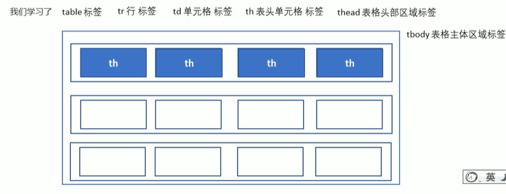

# 前端（h5+css3）  

---  

## 1. Web标准

1. 结构 ——> HTML  
2. 表现 ——> CSS
3. 行为 ——> JavaScript  

---  

## 2. HTML标签
> 大部分是双标签有头有尾  

### 2.1 HTML基本标签  
- HTML标签： 叫做根标签，是页面里面最大的标签  ——> **\<html>\</html>**
- 头部标签： 里面必须设置的标签是title ——> **\<head>\</head>**
- 标题标签： 让页面有一个自己的网页标题 ——>**\<title>\</title>**
- 主体标签： 页面内容基本都放在里面 ——> **\<body>\</body>**  
  
  

参考：*01-HTML.html 的 2.1*  

创建网页时候一个 ***！*** 可补全基本结构  

- **\<!Doctype html>**  是文档类型声明，告诉browser用哪种HTML版本来解析(HTML5)，写在最前面。
- **\<html lang="en">**  是语言种类定义，zh-CN表示中文，en表示英文。（不影响显示多语言）
- **\<meta charset="utf-8">**  是字符集，便于计算机能够识别各种文字，比如 GBK、UTF-8(万国码) 等。

---

### 2.2 HTML常用标签  
- **标题标签：** \<h1> 到 \<h6>，重要性递减
- **段落标签：** \
\

- **换行标签：** \   
- **加粗标签：** \<b>\</b>   or  \<strong>\</strong>
- **斜体标签：** \<i>\</i>   or  \<em>\</em>
- **下划线标签：** \<u>\</u> or  \<ins>\</ins>
- **删除线标签：** \<s>\</s> or  \<del>\</del>
  

参考：*01-HTML.html 的 2.2* 

**\
 和 \ 标签**  
- \
\
 是一个大盒子（占一行），一行只有一个div标签
- \\ 是一个小盒子，一行可以有多个span标签  

**图像标签**
- **\**  
- src属性指定图片的源文件 (必需)
- alt是当图片无法显示时，显示的文字 (可选)
- title是鼠标悬停时显示的文字 (可选)
- width和height属性指定图片的宽度和高度 (可选)
- border属性指定图片的边框宽度 (可选)

**相对路径和绝对路径**
- 相对路径：同级是**直接写**文件名，上一级是**../**，下一级是**/**。
> 比如：
> 1. index.html**同级**的图片是img.png，那么img.png的相对路径是 **img.png**。
> 2. index.html**上一级**的图片是img.png，那么img.png的相对路径是 **../img.png** 。
> 3. index.html**下一级**的图片是img.png，那么img.png的相对路径是 **/img.png** 。

- 绝对路径：就是你的pc的绝对路径，比如："D:/Users/Administrator/Desktop/img.png" 。  
  

**超链接标签**
- \<a href="目标" target="打开方式"> 链接内容 \</a>
- href：指定链接目标（必需），值可以是：
  -  外部网址（需带 http/https，如 "https://baidu.com"）
  -  本地页面路径（如 "page.html"）
  -  锚点（如 现在有一个id为"top"的元素 然后再把href="#top"）
  -  特殊链接（mailto: 邮箱 /tel: 电话）
  -  空链接（#）
  -  下载链接（具体到文件后缀名）
  
- target：指定打开方式
   - _self（默认，当前窗口）
   -  _blank（新窗口）

**其他特殊标签**

---

### 2.3 表格标签  

> 用来展示数据的

- **\<table>\</table>:**   用于定义表格，在最外围。
- **\<tr>\</tr>:** 用于定义行，在表格里面。（table row）
- **\<td>\</td>:** 用于定义单元格，在行里面。（table data）
- **\<th>\</th>:** 用于定义表头单元格，在行里面。(table header) 会居中和加粗 

后续开发用css定义 不太用这些标签  

**表格属性**  
- align：定义表格对齐方式，有 left、center、right 三个值
- border：定义表格边框宽度，默认为""，表示无边框
- cellpadding：定义单元格内边距（单元边沿和内容之间的空白），默认为 1px
- cellspacing：定义单元格间距（单元格之间的空白），默认为 2px
- width：定义表格宽度  

**表格结构标签**
- \<thead>\</thead> 表示表头结构  
- \<tbody>\</tbody> 表示表体结构  

**合并单元格**
- **跨行合并：** 将居于两行的单元格合并成一个单元格，rowspan属性指定合并的行数(从上开始数)
- **跨列合并：** 将居于两列的单元格合并成一个单元格，colspan属性指定合并的列数(从左开始数)

参考：*02-HTML.html*  

---

### 2.4 列表标签
> 用来给元素布局的  

**无序列表：** \<ul>\</ul> 里面放 \<li>\</li> 作为列表元素  （ul里面只能放li，li里面都可以放）
**有序列表：** \<ol\>\</ol\> 里面放 \<li>\</li> 作为列表元素
**定义列表：** \<dl\>\</dl\> 放 \<dt\>\</dt\> 作为列表项，\<dd\>\</dd\> 作为列表项的描述

参考：*02-HTML.html*  

---
### 2.5 表单标签
> 用来收集用户信息  

**\<form>\</form>**  定义表单域
- action 属性：表单提交到的地址
- method 属性：表单提交方式(get/post)
- name 属性：表单名称

**\<input />** 定义输入表单元素 
- type属性：指定输入字段的形式
  

- name 属性：表单元素的名称(单选框和复选框需要相同的name)
- value 属性：输入字段的默认值 or 指定该元素的值
- checked 属性：指定该元素在首次加载时候被选中
- maxlength 属性：指定输入字段的最大长度

**\<label>\</label>** 
- 用于绑定一个表单元素（当点击到这个label时候就自动连接到对应的表单元素），*label的for属性* 对应 *表单元素的id属性*

**\<select>\</select>** 
- 定义下拉列表表单元素，里面用\<option>\</option>定义选项

**\<textarea>**
- 定义文本域表单元素，rows属性定义行数，cols属性定义列数

参考：*02-HTML.html*  

---

## 3.CSS 样式  
> css全称为Cascading Style Sheets，即层叠样式表，也是一种标记语言。  

**语法** 选择器+多条声明（键值对+分号） 写在head标签里面
  

### 3.1 选择器  
> 选中特定的标签  

选择器分为**基础选择器**和**复合选择器**  
**基础选择器**包括：**标签选择器**、**类选择器**、**ID选择器**、**通配符选择器**  

**标签选择器：** 使用标签名称作为选择器，比如`
`标签，选择器为`div`  
**类选择器：** 使用类属性作为选择器，比如`
`标签，选择器为`.box`  
**ID选择器：** 使用ID属性作为选择器，比如`
`标签，选择器为`#box`  
**通配符选择器：** 选择所有标签，选择器为`*`  

**注意**
1. 一个标签可以有多个类名，比如 `
`  
2. id选择器只能被标签调用一次，如果有多个标签有相同id，则只被第一个调用
3. 通配符选择器通常用于样式重置，比如`* {margin:0;padding:0;}`  

参考：*03-CSS.html*  

---

### 3.2 字体样式
- **font-family：** 指定字体比如微软雅黑 `font-family: 'Microsoft Yahei','Times New Roman'`  
- **font-size：** 指定字体大小,比如 `font-size: 20px`  
- **font-weight：** 指定字体粗细，比如 `font-weight: bold` （normal、bold、bolder、lighter、number）   
  or 直接指定权重 `font-weight: 700`
- **font-style：** 斜体 `font-style: italic`
- **复合字体样式：** `font: font-style font-weight font-size/line-height font-family`  （不可颠倒顺序，size和famil不可省略）

参考：*03-CSS.html*  

---

### 3.3 文本样式
- **color：** 字体颜色，可以用预定义的颜色，也可以用十六进制和RGB表示
- **text-align：** 文本对齐方式，比如 `text-align: center` （left是左对齐，right是右对齐，center是居中对齐）
- **text-decoration：** 文本修饰，比如 `text-decoration: underline` （underline是下划线，overline是上划线，line-through是删除线，none是不加修饰这个可以让链接去掉下划线）
- **text-indent：** 文本缩进，比如 `text-indent: 2em` （em是相对单位，比如1em等于当前字体的宽度，2em等于当前字体的宽度的2倍）  
  
参考：*03-CSS.html*  

--- 

### 3.4 外部样式表
> 外部样式表（External Style Sheet）是把样式表保存在单独的文件中，然后通过 `<link>` 标签引入，从而实现样式的复用。

在HTML的 **\<head>** 当中用 **\<link>** 标签引入CSS文件，比如：` <link rel="stylesheet" href="style.css"> `  

参考：*03-CSS.html*  

---

### 3.5 Emmet语法
> Emmet是HTML和CSS的语法扩展，可以快速生成HTML和CSS代码。  

1. 快速生成HTML结构  
   - 生成标签：只需要输入 **标签名称**，比如div，然后按Tab键即可生成一个完整的HTML标签。
   - 多个相同标签：输入标签，比如**div*3**，表示生成三个div标签。
   - 嵌套标签：输入标签，比如**div>p**，表示生成一个div标签，里面有一个p标签。
   - 并列标签：输入标签，比如**div+p**，表示生成一个div标签，后面跟着一个p标签。
   - 类名or id ：输入标签，比如 **#box**，表示生成一个id为box的标签; **.box**，表示生成一个类名为box的标签。
    ` p#box`可以表示创建p标签，并添加id为box。  
    - 类名有顺序：用自增符号 **\$**，比如 **.box$5** 表示生成类名为box1到box5的div标签。
    - 标签内部有文字：用 **{}** 包起来，比如 **div{内容文字}** 表示生成一个div标签，并添加有内容文字。  
 

2. 快速生成CSS样式
  - 同上，用首字母＋数字

### 3.6 复合选择器
> 由多个基础选择器组合，包括 后代选择器、子选择器、并集选择器、伪类选择器等。

**后代选择器**
 可以选择父元素里面的子元素，语法是  `元素1 元素2 {声明}` 代表选择元素1里面的元素2  

 **子选择器**
 可以选择父元素里面的亲儿子元素，语法是  `元素1 > 元素2 {声明}` 代表选择元素1里面相近一级的元素2  

**并集选择器**
 可以同时选择多个元素，语法是  `元素1, 元素2 {声明}` 代表选择元素1和元素2  

 **伪类选择器** 
 可以选择元素，语法是  `元素1: 伪类 {声明}` 代表选择元素1的伪类  

 以下是链接伪类： 
 
 需要按照上面的LVHA顺序来写，确保生效。  

 以下是焦点伪类：
 `input:focus {
   background-color: yellow;
}`

总结：

### 3.7 CSS元素显示模式  
> 一般分为块元素和行内元素  

**块元素**
`<h1>~<h6>、
、
、
、<ul>、<ol>、<li>`等等  
- 独占一行，高度宽度可控制，宽度默认是父级容器的100%，里面可以放行内元素或块级元素。
- 文字标签里面不能放块元素，比如p 标签里面不能放div标签。  

**行内元素**
`<a>、、、<input>、<button>`等等
- 一行可以显示多个，高宽设置无效，宽度默认是内容宽度，行内元素只能容纳文本和其他行内元素。
- 链接里面不能直接放链接。

img标签、input标签、td标签同时具有行内元素特点和块元素特点（一行多个但可以设置宽高）。

总结：

**模式转换**
- 将行内元素转换为块元素：`display: block;` （这样就可以设置宽高了）
- 将块元素转换为行内元素：`display: inline;`
- 转换成行内块元素：`display: inline-block;` 

### 3.8 CSS的背景
CSS的背景属性，可以设置背景颜色、图片、重复方式、位置、透明度。
- background-color: 背景颜色
- background-image: 背景图片 不要忘记url 比如 `background-image: url(xxx.png);`
- background-repeat: 重复方式，有repeat、no-repeat、repeat-x（沿x轴重复）、repeat-y（沿y轴重复）
- background-position: 背景图片的位置,可以接方位名词or精确单位，比如`background-position: top left;` or `background-position: 0 0;`
>  水平方向：left、right，垂直方向是top、bottom；
>  单位：px、%、em等，x从左边开始，y从上面开始。
- background-attachment: 背景图片的固定方式，有scroll(随着滚动)、fixed(固定)。
- 半透明效果： `background: rgba(0,0,0,0.5);` a是控制透明度的
  
总结：

参考：04-CSS.html

---

### 3.9 CSS三大特性
1. **层叠性**（样式冲突时，离得近的或者说后来的样式会覆盖之前的样式）
2. **继承性**（子标签会继承父标签的样式）
3. **优先级**（当一个标签元素指定了多个选择器时，选择器权重大的会覆盖权重小的）
   > **!important** > **行内样式 style=""** > **id选择器** > **类选择器** > **元素标签选择器**（如p） > **继承** or **通配符选择器**
   > **复合选择器的权重** = **!important** * 10000 + **行内样式** * 1000 + **id选择器** * 100 + **类选择器** * 10 + **元素标签选择器** * 1  
   ---
   > 越精确权重越大
    ---

### 3.10 CSS的盒子模型  
> 网页布局的核心：盒子模型、浮动、定位。 CSS的盒子模型，包括内容、边框、填充、外边距。  

边框是boarder，内边距是padding，外边距是margin。

**边框**
- border-width：一般用px做单位
- border-color：同其他颜色
- border-style：看下图，一般是solid、dashed、dotted。
  
- border可以简写，比如 **border-top: 1px solid red;**

表格的话table选择器就是外边框，td选择器就是单元格边框。
- border-collapse：合并相邻的边框，不至于产生两倍的宽度。

边框是在原来盒子的尺寸上加的，所以加边框会把盒子变大。

**内边距**
- padding-top：设置上内边距。
- padding-right：设置右内边距。
- padding-bottom：设置下内边距。
- padding-left：设置左内边距。
- 复合写法：
  

内边距是在原来盒子基础上撑大的，所以加内边距会把盒子变大。所以在开发过程中，把原来盒子的宽和高减去你需要流出的内边距。（边框同理）

**案例参考(新浪导航栏)**：参考 Sian_sidebar.html 

**外边距**
- margin-top：设置上外边距。
- margin-right：设置右外边距。
- margin-bottom：设置下外边距。
- margin-left：设置左外边距。
- margin复写方式：**margin: 10px 20px 30px 40px;** 分别是上外边距、右外边距、下外边距、左外边距。（顺时针）

**相邻块元素的垂直外边距的合并**

**嵌套的块元素的垂直外边距的塌陷**

**清除内外间距**

**案例参考（快报模块**）：参考 kuaibao.html